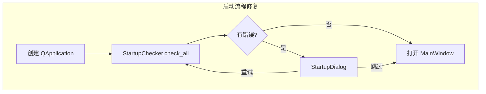

# KVault 全面错误检查、修复与优化计划

## 现状

- 技术栈：Python + PySide6 + ChromaDB + SQLite + Ollama（[README.md](README.md)）
- **无任何测试文件**（无 `tests/`、`pytest.ini`、`test_*.py`）
- 依赖已含运行时库；本地 `.env` 虚拟环境可用；已可安装 `pytest` / `ruff`

## 已识别缺陷（按优先级）

### P0 — 启动与数据完整性

| ID | 问题 | 位置 |
|----|------|------|
| P0-1 | **在创建 `QApplication` 之前弹出 `StartupDialog`**，有检查失败时 Qt 会直接异常 | [main.py](main.py) L25–50 |
| P0-2 | 「重试」仅 `accept()` 后继续启动，**不会重新执行检查**；「跳过」与「继续」行为几乎相同 | [main.py](main.py)、[gui/startup_dialog.py](gui/startup_dialog.py) |
| P0-3 | `delete_partition` 默认 `target_partition_id="全部文档"`（名称而非 UUID），API 误用会把文档挂到无效分区 | [core/metadata_manager.py](core/metadata_manager.py) L326 |
| P0-4 | 导航栏同时存在虚拟「全部文档」与默认分区「全部文档」，**同名双入口**易误导 | [gui/main_window.py](gui/main_window.py) L374–388 |

### P1 — 功能错误 / 异常路径

| ID | 问题 | 位置 |
|----|------|------|
| P1-1 | 空向量库检索时，Chroma 可能返回空 `ids`，`res["ids"][0]` **IndexError** | [core/vector_store.py](core/vector_store.py) L30–48 |
| P1-2 | 按分区检索时若分区无文档，`$in: []` 可能触发 Chroma 查询失败 | [gui/main_window.py](gui/main_window.py) L671–681 |
| P1-3 | MCP 检索先 `top_k` 再事后过滤分区/标签，**匹配结果可能被截断漏掉** | [mcp_server/tools.py](mcp_server/tools.py) L80–121 |
| P1-4 | `ingest_document` 写死默认分区，GUI 事后 `update_partition`；失败路径/一致性差，且缺 `partition_id` 参数 | [core/ingest.py](core/ingest.py)、[gui/main_window.py](gui/main_window.py) L508–518 |
| P1-5 | 重新索引：源文件与 `stored_path` 相同时 `shutil.copy2` 同源拷贝可能失败（Windows） | [core/ingest.py](core/ingest.py) L38 |
| P1-6 | `_resolve_model_name` 日志在赋值后打印，**旧名丢失**（`%s -> %s` 两次新名） | [core/embedding_service.py](core/embedding_service.py) L49–51 |
| P1-7 | 设置未校验 `chunk_overlap < chunk_size`，非法配置可导致切分异常 | [gui/main_window.py](gui/main_window.py) SettingsDialog |

### P2 — 健壮性 / 规范

| ID | 问题 | 位置 |
|----|------|------|
| P2-1 | `list_documents` 中 `partition_id != "全部文档"` 为死代码（实际传 UUID） | [core/metadata_manager.py](core/metadata_manager.py) L229 |
| P2-2 | `create_partition` / `rename_*` 重名时裸抛 `IntegrityError`，GUI 未捕获 | metadata + GUI |
| P2-3 | `_format_size` 对 `<1024` 用 `:.1f` 显示成 `0.0 B` 等，可读性一般 | [gui/main_window.py](gui/main_window.py) L66–71 |
| P2-4 | MCP `_get_services` 每次调用重建客户端，无复用 | [mcp_server/tools.py](mcp_server/tools.py) |



## 实施步骤

### 1. 建立测试基础设施

- 新增 [tests/](tests/)：`conftest.py`（临时 `tmp_path` 数据目录、假 Embedding、内存/临时 SQLite+Chroma）
- 新增 `pytest.ini`：`testpaths = tests`，`pythonpath = .`
- `requirements.txt` 增加开发依赖注释行或单独说明：`pytest`（不强制拆 `requirements-dev.txt`，保持项目简洁）

覆盖范围：

| 层级 | 文件 | 覆盖点 |
|------|------|--------|
| 单元 | `test_text_splitter.py`, `test_document_parser.py`, `test_config.py` | 切分、TXT/空内容、路径解析 |
| 单元 | `test_metadata_manager.py` | CRUD、分区删除目标 ID、标签、列表过滤 |
| 单元 | `test_vector_store.py` | 空库 search、delete_by_document |
| 集成 | `test_ingest_retriever.py` | FakeEmbedder 端到端导入→检索→删除 |
| 集成 | `test_mcp_tools.py` | 空 query、预览、分区过滤（mock embedder） |
| E2E（轻量） | `test_startup_main.py` | 启动检查结果结构；`main` 中 QApplication 先于 Dialog（逻辑单测/导入检查） |

Embedding / Ollama：**全部用 FakeEmbedder**（确定性向量），不依赖本机 Ollama，保证 CI/本地可重复。

### 2. 按优先级修复（核心改动）

1. **[main.py](main.py)**：先 `QApplication(sys.argv)`，再循环执行启动检查；重试重新 `check_all`，跳过才进入主窗口。
2. **[core/metadata_manager.py](core/metadata_manager.py)**：`delete_partition` 默认改为 `DEFAULT_PARTITION_ID`；清理 `"全部文档"` 字符串比较；分区/标签重名返回明确错误或捕获并提示。
3. **[core/vector_store.py](core/vector_store.py)**：空结果安全返回 `[]`；`n_results` 与 `count()` 取 min，避免空库异常。
4. **[core/ingest.py](core/ingest.py)**：增加 `partition_id` 参数；同源路径跳过 `copy2`；失败时保持状态一致。
5. **[gui/main_window.py](gui/main_window.py)**：虚拟节点文案改为「所有文档」；空分区检索直接返回无结果；设置校验 overlap；ingest 传入分区；分区创建重名提示。
6. **[mcp_server/tools.py](mcp_server/tools.py)**：有过滤时扩大候选 `top_k` 再过滤，或先解析 partition/tag → `document_id $in` 再检索；简单缓存 `_get_services`。
7. **[core/embedding_service.py](core/embedding_service.py)**：修复模型名解析日志。

### 3. 代码优化（克制、与修复同批）

- `ingest`：避免二次 `update_partition`；元数据写入时带上 `partition_id`（若写入 chroma metadata，便于后续过滤）。
- `metadata_manager.add_chunks`：批量 `executemany` 替代逐条 INSERT。
- `list_documents` / GUI 过滤：减少「每文档查标签」N+1（过滤时一次 JOIN 或批量取标签）。
- 去掉死代码与重复 `SearchResult` 命名混淆处补模块级注释（不改公共 API 名，避免破坏面过大）。
- 关键 `ruff check` 可自动修的问题（未使用导入等），不做大规模风格重写。

### 4. 验证与交付

```powershell
.\.env\Scripts\Activate.ps1
ruff check core gui mcp_server main.py
pytest -v
```

交付内容（对话内报告，**不新建无关 markdown 文件**，除非你要求写入 `docs/`）：

- 缺陷分类表（P0/P1/P2）+ 根因 + 修复文件
- 优化项说明
- 测试结果摘要（用例数 / 通过率）

## 明确不做的范围

- 不改动用户已有 `data/` 生产数据内容（测试仅用临时目录）
- 不强制依赖真实 Ollama 做回归
- 不做 UI 视觉大改 / 不重写 MCP 协议层
- 不自动 git commit（除非另有指示）
